# Clonger

## Description

A tool for designing conlangs

## Features

The general idea is drawn out in the file [Conlang Creation Tool Design.pdf](./docs/Conlang-Creation-Tool-Design.pdf)

Essentially, there's
 - an area that allows you to type IPA symbols easily and then copy them into various areas
 - an area that allows you to document your language's grammar and stuff in a formatted way using italics, bold, underline, tables, and images
 - an area that allows you to provide examples of your language
 - an area that acts as a dictionary
 
## Running from Souce

In the project's root folder, run the command `dotnet run`

## User's Guide

#### Table of Contents

1. [General Application Control](#general-application-control)
2. [IPA Typing Tool](#ipa-typing-tool)
3. [Language Documentation Manager](#language-documentation-manager)
4. [Dictionary Storage System](#dictionary-storage-system)
5. [Example List View](#example-list-view)

#### General Application Control

You'll notice three sections when starting up the application:

the file management area,

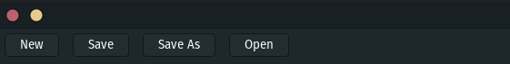

the view switching area,

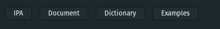

and the view area.

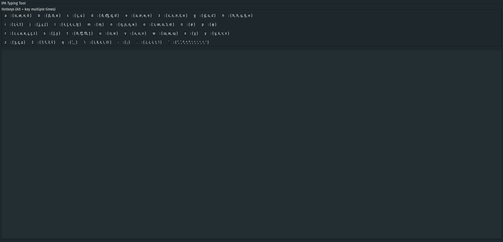

These may be fairly self-explanatory, but I'll go over them regardless.

__*File Management:*__
The file management area contains four buttons:
 - New which clears out all data in the application and all text fields. It also resets the internal "current file name" which can be seen in the Title bar
 - Save which saves changes to the current file and will ask you for a new current file name if one has not been set yet.
 - Save As which is like save, but always asks for a new current file name
 - Open which will populate the application with data from a selected file

__*View Switching Area*__
There are four main views in the application, each doing various tasks, and we'll get to their function later, but the view switching area contains four buttons which, when clicked, will change the view area to reflect the current view.

__*View Area*__
This is the meat and potatoes of the application. This is where all the work is done. Each different view for the application appears here with all its controls.

Moving on, I'll now explain the various application views in order by the view switching area's buttons from right-to-left

#### IPA Typing Tool

If you click the "IPA" button in the view switching area or simply start the application, you'll be met with the IPA Typing Tool View as seen in the View Area's example image.

Here, you'll notice two areas:

a hotkey area
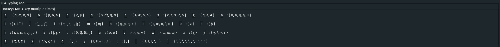

and an input area
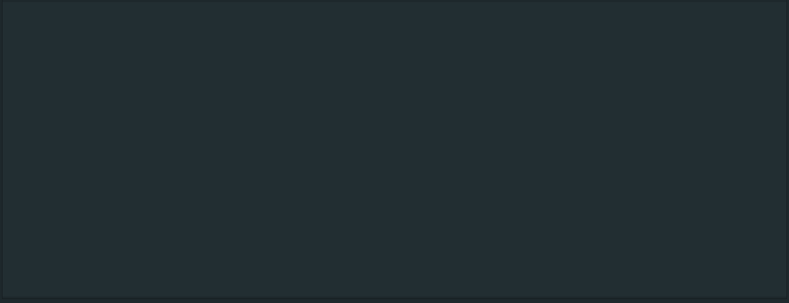

If you type normally in the input area, you may not notice the point of this view. In order to understand, you must press and hold the alt key and one of the keys on the left side of one of the items in the hotkey view.

Let's use 'a' as an example. Here's what it lists in the hotkey view:
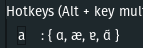

If we type an 'a' normally in the input area, we'll simply get an 'a'
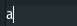

However, if we now press Alt+a, we'll type a different character:
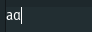

Now, if we let go and press Alt+a again, we'll get that same character,
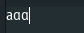

but if keep holding Alt and press a again, then we'll begin to cycle through the special characters listed after a in the hotkey table!
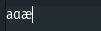
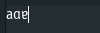

So we can type all of those characters just by pressing Alt+a over and over again, like an old T9 phone keyboard
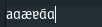

Note that if you hold Alt and switch hotkey, it will place a new character starting from the beginning with the new hotkey. It won't replace the current hotkey as it does if you repeatedly press your chosen character. This makes it so you can type faster.

So if I'm on the third Alt+a and then switch to Alt+b, it will leave that character and place down the first Alt+b as if I had let go and pressed Alt+b. If I switch back to Alt+a, then it'll leave the Alt+b character alone, and reset to the first of a.

That's pretty much it. From here on, you type your characters, then copy and paste them where you need them.

#### Language Documentation Manager

If you now click the Document button, you'll be taken to another view with two text areas. The top area will show formatting after pressing the "Update Format View" button while the bottom area is another text input area.

This is the first view which has data that is saved to the .clong file. The plain text is saved.

There are a few different types of data you can add to this view:
 - Unformatted text
 - Formatted text
 - Tables
 - Images

If you simply start typing, you'll just get plain text:
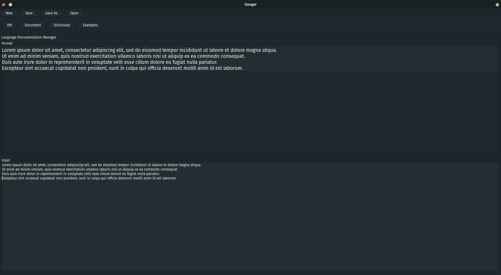

However, there's support for a few basic formattings for text, all of which can be combined with each other:
 - title which simply a larger font
 - subtitle which is also a larger font, but slightly smaller
 - bold, italicized, and underlined which are self explanatory.

The format for making formatted text is to do the following:

`[ <format option 1>, <format option 2>, ... : <text to be formatted> ]`

where \<format option *whatever*\> is `title`, `subtitle`, `bold`, `italicized`, or `underlined`.

Note that if you actually want to type a `[` or `]`, then escape it with `\[` and `\]`

Let's see these in action:
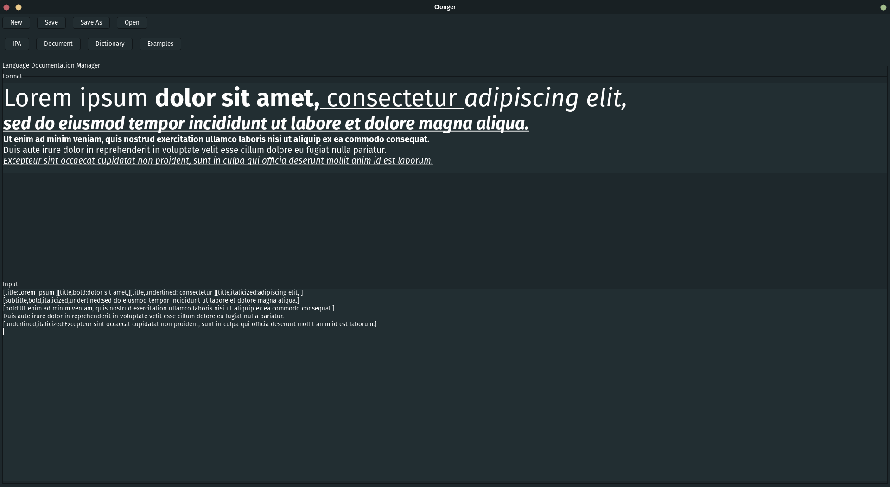

Moving on, the next thing you can do is add an image. We'll go ahead and use one of the images you've seen before

and place it in the documentation view.

The formatting for that command is: `[image:<location of your image>]`

On my computer, that location would be `/home/dylan/Documents/Code Projects/clonger/docs/users-guide-img/ipa-a-all.png`

That makes the final command:
`[image:/home/dylan/Documents/Code Projects/clonger/docs/users-guide-img/ipa-a-all.png]`

Here's what it looks like in the document. Note how text gets split around the image in the formatting:
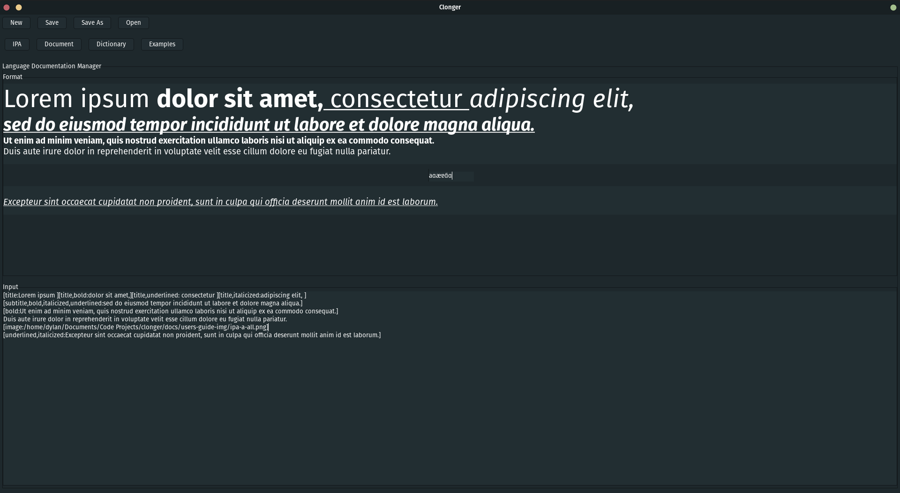

Finally, let's talk tables.

Tables use the following format:
`[table,# rows, #cols : <header 1>, <header 2>, ... <row 1 col 1>, <row 1 col 2>, ..., <row 2 col 1>, <row 2 col 2>, ...]`

You can also format it using multiple lines for readability:
```
[table,# rows, #cols:
    <header 1>, <header 2>, ...
    <row 1 col 1>, <row 1 col 2>, ...,
    <row 2 col 1>, <row 2 col 2>, ...
]
```

And here's an example. Once again, it splits the text:
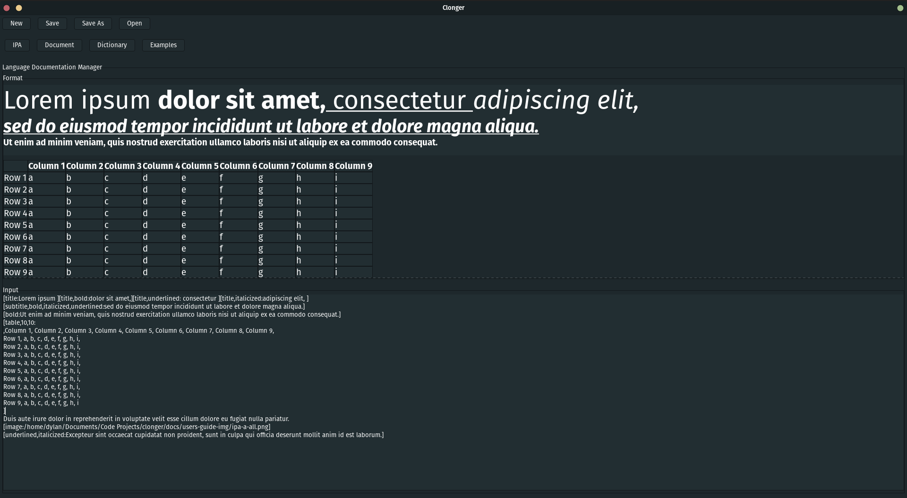

Example text:
```
[table,10,10:
,Column 1, Column 2, Column 3, Column 4, Column 5, Column 6, Column 7, Column 8, Column 9,
Row 1, a, b, c, d, e, f, g, h, i,
Row 2, a, b, c, d, e, f, g, h, i,
Row 3, a, b, c, d, e, f, g, h, i,
Row 4, a, b, c, d, e, f, g, h, i,
Row 5, a, b, c, d, e, f, g, h, i,
Row 6, a, b, c, d, e, f, g, h, i,
Row 7, a, b, c, d, e, f, g, h, i,
Row 8, a, b, c, d, e, f, g, h, i,
Row 9, a, b, c, d, e, f, g, h, i
]
```

Note that not every cell has to be filled in. If you leave it blank between the comments, it'll be empty as per the example.

Also note, that the formatting view has become too big for its area and now has a scrollbar and can be scrolled:
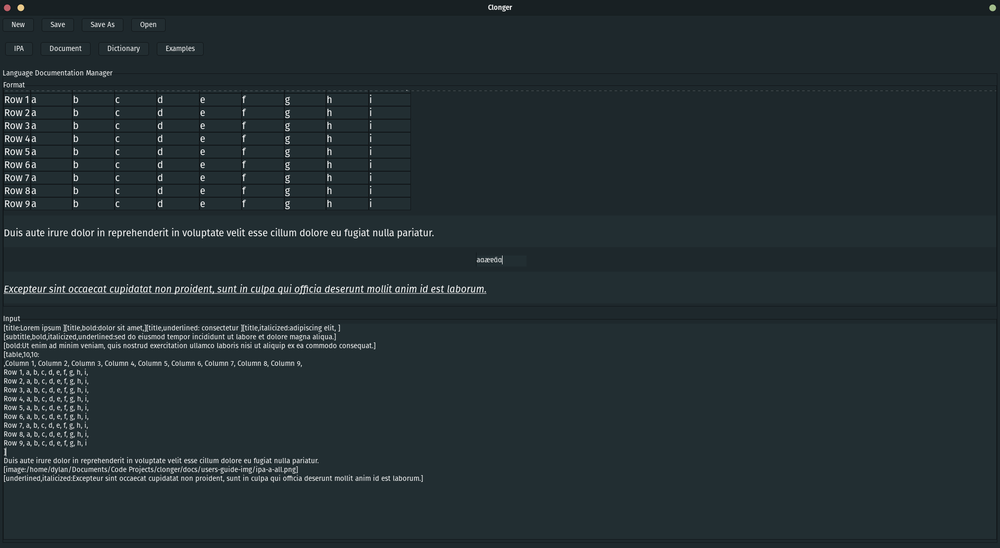

And that'll cover the document tool.

#### Dictionary Storage System

The dictionary view is fairly straight forward. You can search and sort the list of words and create new ones.

Let's start with the additional menu bar:
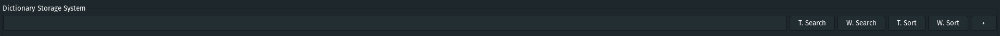

The big long bar in stretching across is the search bar. You type in your keyword and then click either the T. Search or W. Search buttons. T. Search will search for a term under the "Translation" column whereas W. Search uses the romanization Word column.

The sorts work similarly, just alphabetical sorting, instead of a search.

Finally, there's the + button which is used to create new words. It shows a popup view:
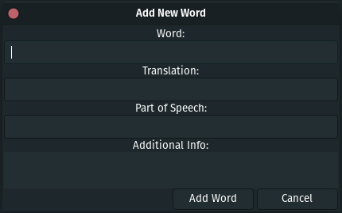

As you can see, you provide the root word (in your romanization), its translation in your native language, and the part of speech of the word. Additionally, there is a multiline text input section to add additional details like conjugations or etymologies or whatever other details you may want to add.

Once words have been added, they'll appear in a table below the menu bar:
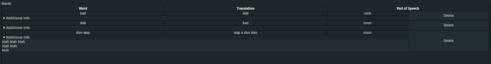

You'll notice that each word has a drop down for the additional details as well as a delete button for removal.

#### Example List View

The example list view, selected by clicking the "Examples" button, is relatively straightforward.

To add an example, you provide the romanization of the example, the IPA for the example, a gloss of the example, and a Native Language translation of the example to the input area and click submit.

Here's what the input area looks like:
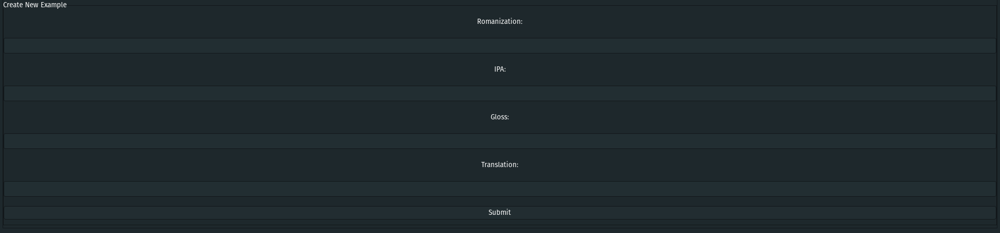

After clicking submit a few times, several examples will appear in the list view:
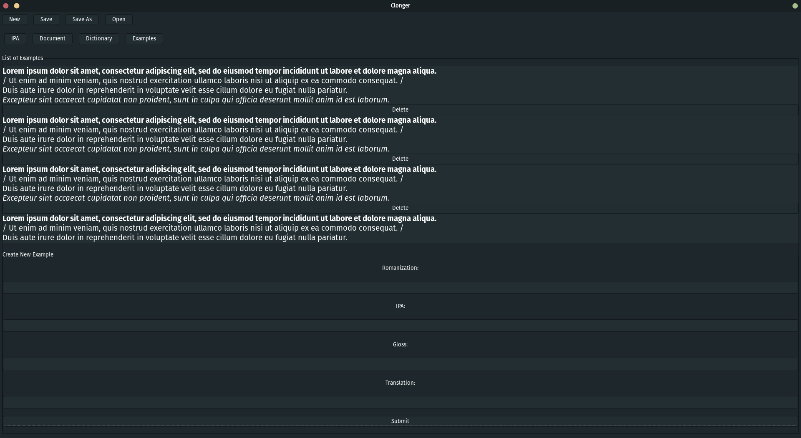

Note that each example also has a delete button beneath it, which will delete the example in the case of a mistake.

Like the Dictionary and the Document views, the data from this view is also saved to file.
